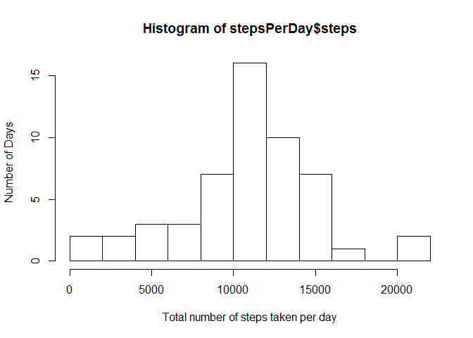
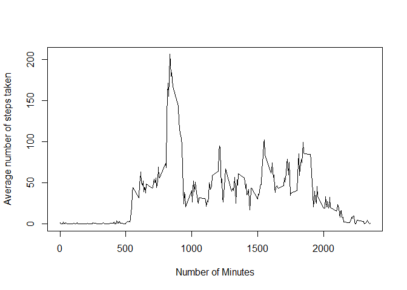
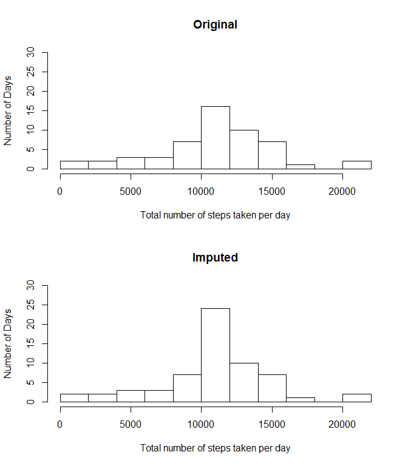

# Reproducible Research: Peer Assessment 1
Eterna2  
Saturday, February 14, 2015  


## 1. Loading and preprocessing the data

Rows with missing values for steps are removed from the dataset, and not considered or displayed in any of the subsequent analysis.

```r
# unzip file
unzip('activity.zip')
# read into memory
dfNA = read.csv('activity.csv', as.is=TRUE)
# remove entries with missing steps
df = dfNA[!is.na(dfNA$steps),]
```


## 2. What is mean total number of steps taken per day?


```r
# sum by date, remove NA
tmp = with(df,by(steps,date,sum))
# rows bind 
tmp = do.call("rbind", as.list(tmp))
# wrap as data frame
stepsPerDay = data.frame(steps=tmp)
```

#### Total number of steps taken per day (# of days = 53)

              steps
-----------  ------
2012-10-02      126
2012-10-03    11352
2012-10-04    12116
2012-10-05    13294
2012-10-06    15420
2012-10-07    11015
2012-10-09    12811
2012-10-10     9900
2012-10-11    10304
2012-10-12    17382
2012-10-13    12426
2012-10-14    15098
2012-10-15    10139
2012-10-16    15084
2012-10-17    13452
2012-10-18    10056
2012-10-19    11829
2012-10-20    10395
2012-10-21     8821
2012-10-22    13460
2012-10-23     8918
2012-10-24     8355
2012-10-25     2492
2012-10-26     6778
2012-10-27    10119
2012-10-28    11458
2012-10-29     5018
2012-10-30     9819
2012-10-31    15414
2012-11-02    10600
2012-11-03    10571
2012-11-05    10439
2012-11-06     8334
2012-11-07    12883
2012-11-08     3219
2012-11-11    12608
2012-11-12    10765
2012-11-13     7336
2012-11-15       41
2012-11-16     5441
2012-11-17    14339
2012-11-18    15110
2012-11-19     8841
2012-11-20     4472
2012-11-21    12787
2012-11-22    20427
2012-11-23    21194
2012-11-24    14478
2012-11-25    11834
2012-11-26    11162
2012-11-27    13646
2012-11-28    10183
2012-11-29     7047

#### Histogram: Total number of steps taken per day

```r
hist(stepsPerDay$steps, breaks = 10, xlab="Total number of steps taken per day", ylab="Number of Days")
```

 

### Discussion
1. Calculate and report the mean and median of the total number of steps taken per day. 


```r
meanStepsPerDay = mean(stepsPerDay$steps)
medianStepsPerDay = median(stepsPerDay$steps)
```

The **mean** and **median** total number of steps taken per day are **10766.19** and **10765** respectively.


## 3. What is the average daily activity pattern?


```r
# sum by interval, remove NA
tmp = with(df,by(steps,interval,mean))
# rows bind 
tmp = do.call("rbind", as.list(tmp))
# wrap as data frame
dailyActivity = data.frame(steps=tmp)
```

#### Average daily number of steps every 5 min intervals

```r
plot(rownames(dailyActivity),dailyActivity$steps, type="l", xlab="Number of Minutes", ylab="Average number of steps taken", main="")
```

 


              steps
-----  ------------
0         1.7169811
5         0.3396226
10        0.1320755
15        0.1509434
20        0.0754717
25        2.0943396
30        0.5283019
35        0.8679245
40        0.0000000
45        1.4716981
50        0.3018868
55        0.1320755
100       0.3207547
105       0.6792453
110       0.1509434
115       0.3396226
120       0.0000000
125       1.1132075
130       1.8301887
135       0.1698113
140       0.1698113
145       0.3773585
150       0.2641509
155       0.0000000
200       0.0000000
205       0.0000000
210       1.1320755
215       0.0000000
220       0.0000000
225       0.1320755
230       0.0000000
235       0.2264151
240       0.0000000
245       0.0000000
250       1.5471698
255       0.9433962
300       0.0000000
305       0.0000000
310       0.0000000
315       0.0000000
320       0.2075472
325       0.6226415
330       1.6226415
335       0.5849057
340       0.4905660
345       0.0754717
350       0.0000000
355       0.0000000
400       1.1886792
405       0.9433962
410       2.5660377
415       0.0000000
420       0.3396226
425       0.3584906
430       4.1132075
435       0.6603774
440       3.4905660
445       0.8301887
450       3.1132075
455       1.1132075
500       0.0000000
505       1.5660377
510       3.0000000
515       2.2452830
520       3.3207547
525       2.9622642
530       2.0943396
535       6.0566038
540      16.0188679
545      18.3396226
550      39.4528302
555      44.4905660
600      31.4905660
605      49.2641509
610      53.7735849
615      63.4528302
620      49.9622642
625      47.0754717
630      52.1509434
635      39.3396226
640      44.0188679
645      44.1698113
650      37.3584906
655      49.0377358
700      43.8113208
705      44.3773585
710      50.5094340
715      54.5094340
720      49.9245283
725      50.9811321
730      55.6792453
735      44.3207547
740      52.2641509
745      69.5471698
750      57.8490566
755      56.1509434
800      73.3773585
805      68.2075472
810     129.4339623
815     157.5283019
820     171.1509434
825     155.3962264
830     177.3018868
835     206.1698113
840     195.9245283
845     179.5660377
850     183.3962264
855     167.0188679
900     143.4528302
905     124.0377358
910     109.1132075
915     108.1132075
920     103.7169811
925      95.9622642
930      66.2075472
935      45.2264151
940      24.7924528
945      38.7547170
950      34.9811321
955      21.0566038
1000     40.5660377
1005     26.9811321
1010     42.4150943
1015     52.6603774
1020     38.9245283
1025     50.7924528
1030     44.2830189
1035     37.4150943
1040     34.6981132
1045     28.3396226
1050     25.0943396
1055     31.9433962
1100     31.3584906
1105     29.6792453
1110     21.3207547
1115     25.5471698
1120     28.3773585
1125     26.4716981
1130     33.4339623
1135     49.9811321
1140     42.0377358
1145     44.6037736
1150     46.0377358
1155     59.1886792
1200     63.8679245
1205     87.6981132
1210     94.8490566
1215     92.7735849
1220     63.3962264
1225     50.1698113
1230     54.4716981
1235     32.4150943
1240     26.5283019
1245     37.7358491
1250     45.0566038
1255     67.2830189
1300     42.3396226
1305     39.8867925
1310     43.2641509
1315     40.9811321
1320     46.2452830
1325     56.4339623
1330     42.7547170
1335     25.1320755
1340     39.9622642
1345     53.5471698
1350     47.3207547
1355     60.8113208
1400     55.7547170
1405     51.9622642
1410     43.5849057
1415     48.6981132
1420     35.4716981
1425     37.5471698
1430     41.8490566
1435     27.5094340
1440     17.1132075
1445     26.0754717
1450     43.6226415
1455     43.7735849
1500     30.0188679
1505     36.0754717
1510     35.4905660
1515     38.8490566
1520     45.9622642
1525     47.7547170
1530     48.1320755
1535     65.3207547
1540     82.9056604
1545     98.6603774
1550    102.1132075
1555     83.9622642
1600     62.1320755
1605     64.1320755
1610     74.5471698
1615     63.1698113
1620     56.9056604
1625     59.7735849
1630     43.8679245
1635     38.5660377
1640     44.6603774
1645     45.4528302
1650     46.2075472
1655     43.6792453
1700     46.6226415
1705     56.3018868
1710     50.7169811
1715     61.2264151
1720     72.7169811
1725     78.9433962
1730     68.9433962
1735     59.6603774
1740     75.0943396
1745     56.5094340
1750     34.7735849
1755     37.4528302
1800     40.6792453
1805     58.0188679
1810     74.6981132
1815     85.3207547
1820     59.2641509
1825     67.7735849
1830     77.6981132
1835     74.2452830
1840     85.3396226
1845     99.4528302
1850     86.5849057
1855     85.6037736
1900     84.8679245
1905     77.8301887
1910     58.0377358
1915     53.3584906
1920     36.3207547
1925     20.7169811
1930     27.3962264
1935     40.0188679
1940     30.2075472
1945     25.5471698
1950     45.6603774
1955     33.5283019
2000     19.6226415
2005     19.0188679
2010     19.3396226
2015     33.3396226
2020     26.8113208
2025     21.1698113
2030     27.3018868
2035     21.3396226
2040     19.5471698
2045     21.3207547
2050     32.3018868
2055     20.1509434
2100     15.9433962
2105     17.2264151
2110     23.4528302
2115     19.2452830
2120     12.4528302
2125      8.0188679
2130     14.6603774
2135     16.3018868
2140      8.6792453
2145      7.7924528
2150      8.1320755
2155      2.6226415
2200      1.4528302
2205      3.6792453
2210      4.8113208
2215      8.5094340
2220      7.0754717
2225      8.6981132
2230      9.7547170
2235      2.2075472
2240      0.3207547
2245      0.1132075
2250      1.6037736
2255      4.6037736
2300      3.3018868
2305      2.8490566
2310      0.0000000
2315      0.8301887
2320      0.9622642
2325      1.5849057
2330      2.6037736
2335      4.6981132
2340      3.3018868
2345      0.6415094
2350      0.2264151
2355      1.0754717

#### Discussion
1. Which 5-minute interval, on average across all the days in the dataset, contains the maximum number of steps?


```r
# get max steps
maxActivity = max(dailyActivity)
# get the index
index = which.max(dailyActivity==maxActivity)
# get the actual interval value
maxInterval = rownames(dailyActivity)[index]
```

The  **Interval 835 - 840  minutes** on average across all the days in the dataset, contains the maximum number of steps.

## 4. Imputing missing values

Missing values are imputed using the average daily activity level for the specified interval.


```r
# create dict to map between interval and average steps taken
imputDict = cbind(interval=rownames(dailyActivity),steps=dailyActivity)
# create a copy
dfnew = dfNA
# loop
for (i in 1:nrow(dfnew)) 
{
  # check for NA
  if (is.na(dfnew[i,]$steps)) 
  {
    # replace NA with average step for that interval
    dfnew[i,]$steps = imputDict$steps[imputDict$interval == dfnew[i,]$interval] 
  }
}
```


```r
# sum by date, remove NA
tmp = with(dfnew,by(steps,date,sum))
# rows bind 
tmp = do.call("rbind", as.list(tmp))
# wrap as data frame
stepsPerDayNew = data.frame(steps=tmp)
```

#### Total number of steps taken per day  (# of days = 61)

date          steps (original)   steps (imputed)
-----------  -----------------  ----------------
2012-10-01                  NA          10766.19
2012-10-02                 126            126.00
2012-10-03               11352          11352.00
2012-10-04               12116          12116.00
2012-10-05               13294          13294.00
2012-10-06               15420          15420.00
2012-10-07               11015          11015.00
2012-10-08                  NA          10766.19
2012-10-09               12811          12811.00
2012-10-10                9900           9900.00
2012-10-11               10304          10304.00
2012-10-12               17382          17382.00
2012-10-13               12426          12426.00
2012-10-14               15098          15098.00
2012-10-15               10139          10139.00
2012-10-16               15084          15084.00
2012-10-17               13452          13452.00
2012-10-18               10056          10056.00
2012-10-19               11829          11829.00
2012-10-20               10395          10395.00
2012-10-21                8821           8821.00
2012-10-22               13460          13460.00
2012-10-23                8918           8918.00
2012-10-24                8355           8355.00
2012-10-25                2492           2492.00
2012-10-26                6778           6778.00
2012-10-27               10119          10119.00
2012-10-28               11458          11458.00
2012-10-29                5018           5018.00
2012-10-30                9819           9819.00
2012-10-31               15414          15414.00
2012-11-01                  NA          10766.19
2012-11-02               10600          10600.00
2012-11-03               10571          10571.00
2012-11-04                  NA          10766.19
2012-11-05               10439          10439.00
2012-11-06                8334           8334.00
2012-11-07               12883          12883.00
2012-11-08                3219           3219.00
2012-11-09                  NA          10766.19
2012-11-10                  NA          10766.19
2012-11-11               12608          12608.00
2012-11-12               10765          10765.00
2012-11-13                7336           7336.00
2012-11-14                  NA          10766.19
2012-11-15                  41             41.00
2012-11-16                5441           5441.00
2012-11-17               14339          14339.00
2012-11-18               15110          15110.00
2012-11-19                8841           8841.00
2012-11-20                4472           4472.00
2012-11-21               12787          12787.00
2012-11-22               20427          20427.00
2012-11-23               21194          21194.00
2012-11-24               14478          14478.00
2012-11-25               11834          11834.00
2012-11-26               11162          11162.00
2012-11-27               13646          13646.00
2012-11-28               10183          10183.00
2012-11-29                7047           7047.00
2012-11-30                  NA          10766.19

#### Histogram: Total number of steps taken per day

```r
par(mfrow=c(2,1))
hist(stepsPerDay$steps, breaks = 10, ylim=c(0, 30), xlab="Total number of steps taken per day", ylab="Number of Days", main="Original")
hist(stepsPerDayNew$steps, breaks = 10, ylim=c(0, 30), xlab="Total number of steps taken per day", ylab="Number of Days", main="Imputed")
```

 


#### Discussion

1. Calculate and report the mean and median total number of steps taken per day. 


```r
meanStepsPerDayNew = mean(stepsPerDayNew$steps)
medianStepsPerDayNew = median(stepsPerDayNew$steps)
```
The **mean** and **median** total number of steps taken per day of the imputed dataset are **10766.19** and **10766.19** respectively.

2. Do these values differ from the estimates from the first part of the assignment? 

```
d(mean) = 0  
d(median) = 1.188679
```

3. What is the impact of imputing missing data on the estimates of the total daily number of steps?  

As imputing is done using the average daily activity, there is no impact on the *mean*. However, the median is increased slightly as more days with average activity (formerly not included in the 1st study) are included in the analysis.


## 5. Are there differences in activity patterns between weekdays and weekends?

#### Appending weekend/weekday to the data

```r
# get the day from date
days = weekdays(as.Date(dfnew$date))
# replace sun and sat with weekend
days[days=="Sunday" | days=="Saturday"] = "weekend"
# replace the rest with weekday
days[days!="weekend"] = "weekday"
# append new col to data
dfnew = cbind(dfnew,day=as.factor(days))
```


#### Tidying the data for Lattice plotting

```r
# group by interval and day
tmp = with(dfnew,by(steps,list(interval,day),mean))
# form a data frame
dailyActivityAll = data.frame(cbind(tmp))
# extract just weekend
weekend = cbind(interval=rownames(dailyActivityAll),steps=dailyActivityAll$weekend,day="weekend")
# extract just weekday
weekday = cbind(interval=rownames(dailyActivityAll),steps=dailyActivityAll$weekday,day="weekday")
# tidy up data for lattice input
dailyActivityAll = data.frame(rbind(weekend,weekday))
dailyActivityAll$day = as.factor(dailyActivityAll$day )
dailyActivityAll$interval = as.numeric(as.character(dailyActivityAll$interval))
dailyActivityAll$steps = as.numeric(as.character(dailyActivityAll$steps))
```

#### Comparison of average activity between weekend and weekdays

```r
library(lattice) 
xyplot(steps ~ interval | day, data = dailyActivityAll, type='l', layout = c(1,2), xlab="Interval",ylab="Number of steps")
```

 

#### Discussion

As shown in the charts on weekdays, average activity is much higher in the morning and lower for the rest of the day. A probably explaination would be that people tend to wake earlier and travel to work during weekend mornings. Similarly during weekday afternoons, most people should be working at their desk which result in a lower activity. 

